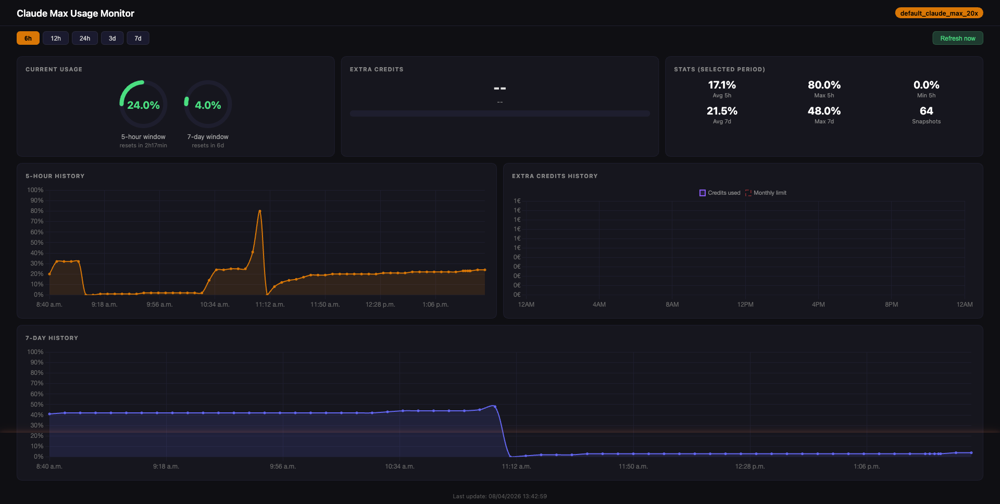

# claudemonit

Monitors your Claude Max subscription usage. Collects usage stats every 5 minutes and displays them on an analytics dashboard.



## What's tracked

- **5-hour window**: rolling 5-hour quota utilization
- **7-day window**: rolling 7-day quota utilization
- **Extra credits**: extra usage consumption in euros (cents from API)

## Stack

- Node.js + Express
- SQLite (better-sqlite3) for storage
- node-cron for polling every 5 minutes
- Chart.js for charts

## Install

```bash
npm install
```

## Run

### With pm2 (recommended, runs in background)

```bash
pm2 start server.js --name claudemonit
pm2 save
```

### Without pm2

```bash
npm start
```

## pm2 commands

```bash
pm2 status              # check status
pm2 logs claudemonit    # view logs
pm2 restart claudemonit # restart
pm2 stop claudemonit    # stop
pm2 delete claudemonit  # remove
```

## Dashboard

Available at **http://localhost:3377**

## API

- `GET /api/latest` - latest snapshot
- `GET /api/snapshots?hours=24` - history (default 24h)
- `POST /api/snapshot` - force a snapshot now

## Config

- Port: env variable `PORT` (default `3377`)
- Token: read automatically from `~/.claude/.credentials.json`
